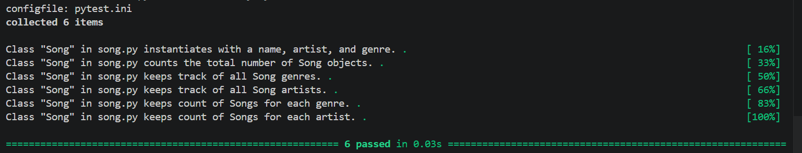

# 🎵 Music Library System (Python OOP)

## 📌 About This Project

This project is a Python Object-Oriented Programming (OOP) lab that models a simple music library system. It demonstrates how to use classes to create objects and also maintain shared data across all instances using class attributes.

Every time a new `Song` object is created, the system automatically updates global statistics such as total songs, artists, and genres.

---

## 🎯 Goals of the Project

The main goals are to:

* Practice Python OOP concepts
* Understand instance vs class attributes
* Use class methods effectively
* Track shared data across multiple objects
* Work with automated testing using pytest

---

## 🎶 Song Class

### Instance Attributes

Each song object contains:

* `name`
* `artist`
* `genre`

---

### Class Attributes (Shared Data)

The class keeps track of:

* `count` → Total number of songs created
* `artists` → Unique list of artists
* `genres` → Unique list of genres
* `artist_count` → Number of songs per artist
* `genre_count` → Number of songs per genre

---

## ⚙️ Class Methods

These methods automatically update class data when a new song is created:

* `add_song_to_count()` → increments total song count
* `add_to_artists()` → stores unique artists only
* `add_to_genres()` → stores unique genres only
* `add_to_artist_count()` → tracks songs per artist
* `add_to_genre_count()` → tracks songs per genre

---

## 🧪 Testing

This project uses `pytest` to verify functionality.

### Run tests:

```bash id="h1k9qz"
pytest
```

### Expected output:

```text id="v8m3nx"
6 passed
```

All tests confirm:

* Song objects are created correctly
* Class attributes update properly
* Artists and genres are tracked correctly
* Counts are accurate

---

## 📁 Project Structure

```text id="c3k8pw"
lib/
 ├── song.py
 ├── testing/
 │    ├── conftest.py
 │    └── song_test.py
 └── __pycache__/

screenshots/
 └── pytest-result.png

README.md
```

---

## 📸 Screenshot

### ✔ Test Results

All unit tests pass successfully:



---

## 🚀 Example

```python id="z9m2ld"
Song("Halo", "Beyonce", "Pop")
Song("In the End", "Linkin Park", "Rock")
```

This automatically updates:

* Total song count
* Artist list and counts
* Genre list and counts

---

## 🧹 Notes

* Do not commit `__pycache__` or `.pytest_cache`
* Only include source code, README, and screenshots
* Ensure all tests pass before submission

---


